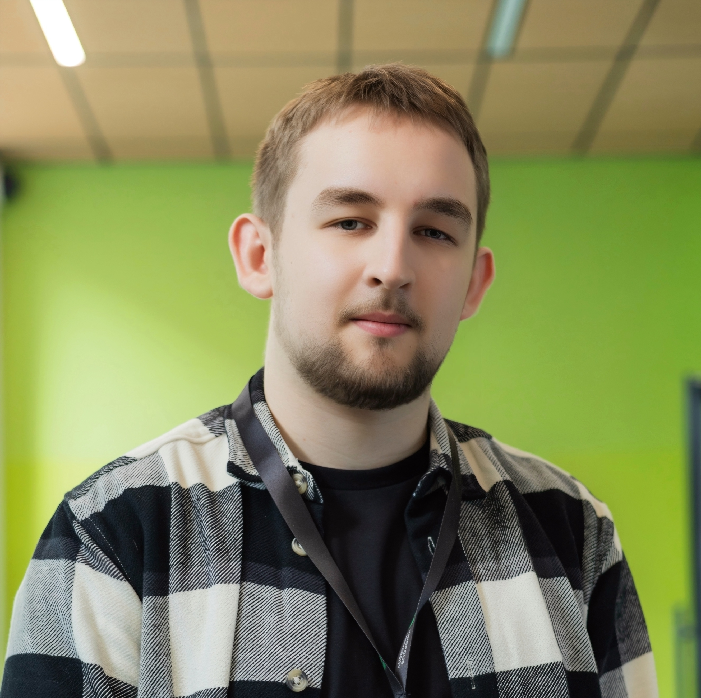

  

  # Стояновский Никита Анатольевич

  ### Разработчик широкого профиля: backend, frontend, DevOps и интерес к кибербезопасности

  
  

---

## Обо мне

Мне интересно понимать программные системы целиком: от backend-логики и структуры базы данных до frontend, CI/CD, развёртывания и вопросов безопасности. Если задача требует выйти за пределы привычного стека, я готов изучить нужную технологию и разобраться в ней на практике.

Особенно ценю инженерный подход к разработке: если код работает не так, как ожидалось, сначала ищу причину ошибки, чтобы понять её и не повторять в будущем, и только после этого исправляю реализацию.

### Основной стек

---

## Главный проект — CareerAI

**CareerAI** — итоговый дипломный проект Московской школы программистов, разработанный с марта по май 2025 года командой из 6 человек. Я выступал в роли **тимлида**, участвовал в backend-разработке и отвечал за инфраструктурную часть проекта.

> На момент начала разработки мы не нашли аналогов, которые одновременно давали работодателям и соискателям LLM-инструменты для анализа вакансий и ранжирования резюме.

**Результат:** проект был защищён на **«отлично»** и развёрнут в production.

### Моя зона ответственности

- распределял задачи между backend- и frontend-разработчиками и балансировал нагрузку внутри команды;
- контролировал качество и корректность кода;
- проектировал и настраивал PostgreSQL-базу данных, в том числе создавал необходимые таблицы;
- реализовал кастомную авторизацию пользователей;
- реализовал интеграцию с LLM API;
- писал pipeline-процессы для GitLab CI/CD;
- настроил резервное дублирование коммитов из закрытой инфраструктуры МШП на GitHub;
- лично отвечал за развёртывание проекта в production и работу сайта `careerai.ru`;
- участвовал в backend-разработке проекта и взаимодействии backend с frontend.

### Технологии

**Backend и инфраструктура:** Python, Django, Django REST Framework, PostgreSQL, Docker, GitLab CI/CD, Git, Pytest, Daphne, `requests`, `python-dotenv`, `whitenoise`, `psycopg2-binary`.

**Frontend:** JavaScript, Jinja, Bootstrap, AJAX.

**Архитектурные подходы:** паттерны **Наблюдатель**, **Посредник** и **Стратегия**.

---

## Опыт и достижения

### Московская школа программистов — 2018–2025

Я учился в МШП **7 лет** и в 2025 году завершил обучение **с отличием**.

Среди профильных дисциплин программы:

- программирование на Python;
- объектно-ориентированное программирование на C++;
- алгоритмика;
- компьютерные сети;
- архитектура ЭВМ;
- дискретная математика;
- Data Science: анализ данных на Python;
- DevOps-инженерия;
- кибербезопасность;
- разработка пользовательских интерфейсов;
- разработка приложений на C#/.NET.

<b>Посмотреть свидетельство об окончании МШП с отличием</b>

 

  
  
  

### Призёр муниципального этапа ВсОШ по информатике

- **2024** — призёр муниципального этапа ВсОШ по информатике, г. Королёв;
- **2025** — призёр муниципального этапа ВсОШ по информатике, г. Королёв.

### Хакатон МШП 2025

В команде разрабатывал веб-сервис в формате **таск-трекера / таск-менеджера**. Работал одновременно как backend- и frontend-разработчик.

**Стек:** Python, Django, SQLite, Bootstrap.

Главный результат участия — опыт разработки MVP в условиях ограниченного времени и практическое знакомство с подходами экстремального программирования.

> Исходный код проекта находится в закрытом GitLab Московской школы программистов, поэтому публичная ссылка на репозиторий отсутствует.

### Внутренние CTF-соревнования МШП — 2024

Участвовал во внутренних соревнованиях по CTF. Этот опыт стал одной из отправных точек моего интереса к кибербезопасности.

---

## Технические навыки

| Направление | Навыки |
|---|---|
| **Backend** | Python, Django, Django REST Framework, PostgreSQL, REST API, тестирование с Pytest |
| **Frontend** | JavaScript на начальном уровне, Jinja, Bootstrap, AJAX |
| **DevOps** | Docker, GitLab CI/CD, развёртывание веб-приложений, Git |
| **Языки** | Python, C++ (ООП), базовое знакомство с C#, начальный JavaScript, изучаю Go |
| **Кибербезопасность** | базовый практический опыт через CTF, дальнейшее развитие в области информационной безопасности |
| **Инструменты разработки** | Git, GitLab, GitHub, LLM-инструменты с обязательной ручной проверкой сгенерированного кода |

---

## Что я могу предложить как разработчик

**Разбираюсь в причине, а не только исправляю симптом.** Если реализация работает неправильно, сначала стараюсь понять источник проблемы и только после этого менять код.

**Осторожно отношусь к системе контроля версий.** Перед отправкой изменений стараюсь покрыть новую логику тестами, самостоятельно проверить её работу и только после этого делать commit с понятным описанием изменений.

**Готов работать на границе нескольких направлений.** При необходимости могу переключаться между backend и frontend, разбираться в инфраструктуре и изучать новые технологии под конкретную задачу.

**Использую LLM как инструмент, а не как замену пониманию.** Сгенерированный код обязательно проверяю и анализирую перед использованием.

---

## Куда развиваюсь сейчас

Сейчас хочу системно развиваться в **кибербезопасности**, не ограничивая себя одним узким направлением. Мне интересно расширить базу, получить больше практического опыта и лучше понимать безопасность современных программных систем на разных уровнях.

---

## Контакты

- **GitHub:** [github.com/skyer12322](https://github.com/skyer12322)
- **Telegram:** [@stoyanovskii_n](https://t.me/stoyanovskii_n)

  Спасибо, что посмотрели моё портфолио.

